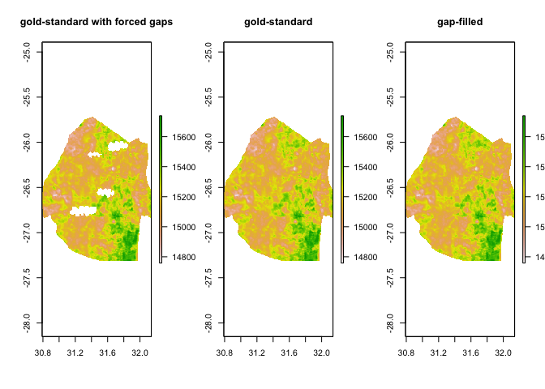
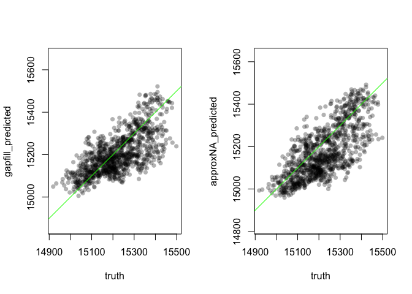

Gapfilling algorithm
================

## Gapfilling raster data

Often remotely sensed data have gaps across space and time, due to
things like cloud. While functions like approxNA from the raster package
can be useful as way to interpolate missing values from their neighbours
in time, as many remotely sensed layers are related to elevation, it
should be possible to also include an elevation effect when predicting
missing values. This algorithm uses random forest model, with
interpolated values, elevation and time to fill in the gaps. It will
also work with single raster layers (i.e. from a single time slice) but
instead of using a random forest, it fits a Generalized Additive Model
with a smooth on elevation and a bivariate smooth on longitude and
latitude.

Let’s test the algorithm wuth some artifically enforced missing values.

``` r
library(deldir, quietly = TRUE)
library(raster, quietly = TRUE)
library(randomForest, quietly=TRUE)
library(sf)
source("https://raw.githubusercontent.com/HughSt/gapfilling_rasters/master/gapfill.R")
```

``` r
# Load monthly land surface temperature data from 2015 for Swaziland
LST <- stack("https://www.dropbox.com/s/sw0lfh2mwrhhqm6/LST_2015.tif?dl=1")

# Save for later
LST_gold_standard <- LST

# get elevation data for country
elevation <- raster::getData('alt',country="SWZ")
elevation <- resample(elevation, LST) # To ensure same extent and resolution

# Get Swaziland outline
swz_adm0 <- raster::getData("GADM", country = "SWZ", level=0)
```

We are now going to import some fake clouds and use these to generate some missing values in the 2 (arbitrary) time slice
```{r}
clouds <- st_read("https://raw.githubusercontent.com/HughSt/gapfilling_rasters/master/clouds_swz.geojson")
LST[[2]] <- mask(LST[[2]], clouds, inverse = TRUE)
```

Now let's run the algorithm.
``` r
LST_gapfilled <- gapfill(LST, elevation, data_points = 40000)

# Plot results for 1 time slice
par(mfrow=c(1,3))
plot(mask(LST[[2]], swz_adm0), main = "gold-standard with forced gaps")
plot(mask(LST_gold_standard [[2]], swz_adm0), main = "gold-standard")
plot(mask(LST_gapfilled[[2]], swz_adm0), main = "gap-filled")# gap-filled comparison
```

<!-- -->

Look at observed versus predicted for the artificailly created NAs

``` r
# Get predictions so that they match up with validationData
# and plot results
missing_pixels <- which(is.na(LST[[2]][]))
truth <- LST_gold_standard[[2]][missing_pixels]
gapfill_predicted <- LST_gapfilled[[2]][missing_pixels]
approxNA_predicted <- approxNA(LST)[[2]][missing_pixels]

par(mfrow=c(1,2))
plot(truth, gapfill_predicted, asp=1, pch=16, col=rgb(0,0,0,0.3)); abline(0,1, col="green")
plot(truth, approxNA_predicted, asp=1, pch=16, col=rgb(0,0,0,0.3)); abline(0,1, col="green")
```

<!-- -->

``` r
paste("Mean squared error using gapfill", floor(mse(truth, gapfill_predicted)))
```

    ## [1] "Mean squared error using gapfill 7391"

``` r
paste("Mean squared error using approxNA", floor(mse(truth, approxNA_predicted)))
```

    ## [1] "Mean squared error using approxNA 9910"
