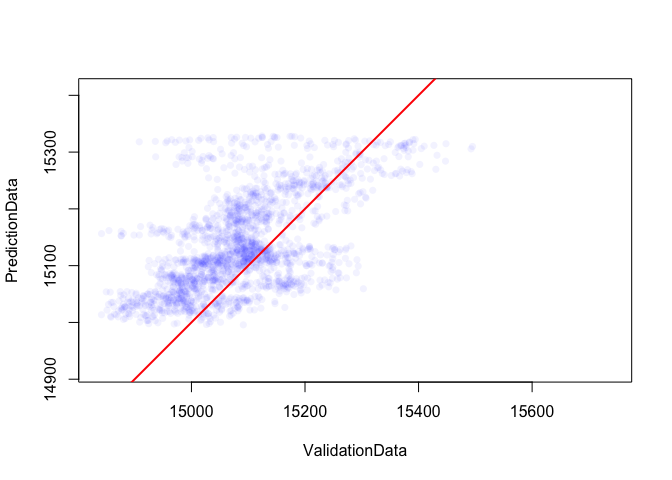

Gapfilling raster data
================


Often remotely sensed data have gaps across space and time, due to things like cloud. This algorithm used a spatio-temporal model, plus elevation, to fill in the gaps.


``` r
# Run algorithm on LST data for Swaziland with artificially created gaps (LST)
LST_gapfilled <- gapfill_GAM(LST, elevation, data_points = 20000)

# Plot results for 1 time slice
par(mfrow=c(1,3))
plot(LST[[2]], main = "gold-standard with forced gaps")
plot(LST_gold_standard [[2]], main = "gold-standard")
plot(LST_gapfilled[[2]], main = "gap-filled")# gap-filled comparison
```


``` r
# Look at observed versus predicted across all time slices
```


