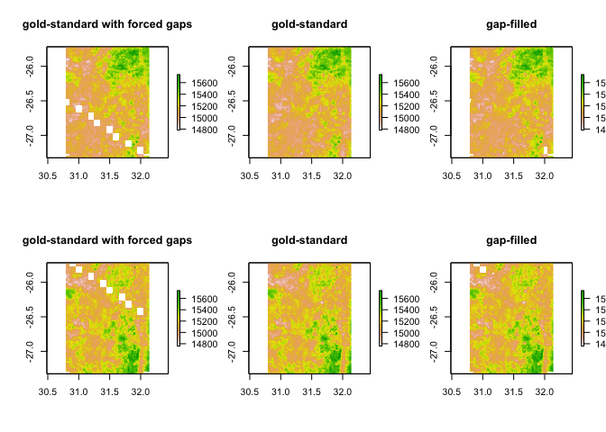
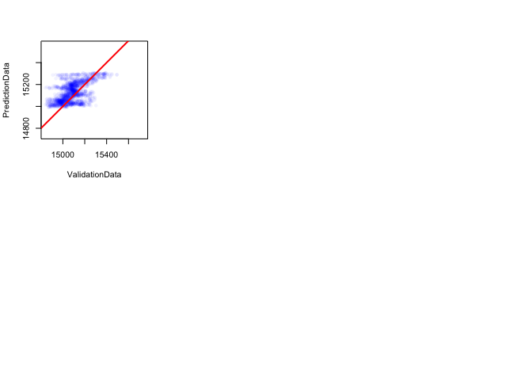

Untitled
================

GitHub Documents
----------------

This is an R Markdown format used for publishing markdown documents to GitHub. When you click the **Knit** button all R code chunks are run and a markdown file (.md) suitable for publishing to GitHub is generated.

Including Code
--------------

You can include R code in the document as follows:

``` r
library(deldir)
```

    ## deldir 0.1-15

``` r
library(raster)
```

    ## Warning: package 'raster' was built under R version 3.5.2

    ## Loading required package: sp

``` r
##### TEST THE GAP-FILL FUNCTION

# Load some test RS data
LST <- stack("https://www.dropbox.com/s/sw0lfh2mwrhhqm6/LST_2015.tif?dl=1")

# Save for later
LST_gold_standard <- LST

# get elevation data for country
elevation <- raster::getData('alt',country="SWZ")
elevation <- resample(elevation, LST) # To ensure same extent and resolution

# Remove some chunks of the gold standard 
# (first 2 time slices) to 
# act as validation data
grid_sizes <- 0.1
  for (k in 1:length(grid_sizes)){
        validation_grid <- expand.grid(x = seq(min(coordinates(LST)[,1]), max(coordinates(LST)[,1])+grid_sizes[1],
                                             grid_sizes[k]),
                                     y = seq(min(coordinates(LST)[,2]), max(coordinates(LST)[,2])+grid_sizes[1],
                                             grid_sizes[k]))
        }
      
        # generate voronoi polygons
        dd <- deldir(validation_grid$x, validation_grid$y)
```

    ## 
    ##      PLEASE NOTE:  The components "delsgs" and "summary" of the
    ##  object returned by deldir() are now DATA FRAMES rather than
    ##  matrices (as they were prior to release 0.0-18).
    ##  See help("deldir").
    ##  
    ##      PLEASE NOTE: The process that deldir() uses for determining
    ##  duplicated points has changed from that used in version
    ##  0.0-9 of this package (and previously). See help("deldir").

``` r
        tiles <- tile.list(dd)
        polys <- vector(mode='list', length=length(tiles ))
        for (i in seq(along=polys)) {
          pcrds <- cbind(tiles [[i]]$x, tiles [[i]]$y)
          pcrds <- rbind(pcrds, pcrds[1,])
          polys[[i]] <- Polygons(list(Polygon(pcrds)), ID=as.character(i))
        }
        SP <- SpatialPolygons(polys)
        
        # Randomly choose some squares to remove data from
        nRemove <- 20
        toRemove <- round(seq(1,length(SP),length.out = nRemove))
        SPtoRemove <- SP[toRemove,]
        
        # Ramdomly remove some data points
        rasterCoords <- SpatialPoints(coordinates(LST[[1]]))
        pixelsInSP <- over(rasterCoords, SPtoRemove)
        
        RandSpace <- c(which(pixelsInSP<=nRemove/2),
                       which(pixelsInSP>nRemove/2))
        RandTime <- c(rep(1,length(RandSpace)/2),rep(2,length(RandSpace)/2))
      
      # RandSpace <- sample(which(!is.na(elevation[])),10000)
      # RandTime <- sample(5:6,1000,replace=T)
      
      # Store validation data
      ValidationData<-NULL
      for(i in 1:length(RandSpace)){
        ValidationData <- c(ValidationData, LST[[RandTime[i]]][RandSpace[i]])
        LST[[RandTime[i]]][RandSpace[i]] <- NA # remove
}

# Run model and plot results
LST_gapfilled <- gapfill_GAM(LST, elevation, data_points = 40000)
par(mfrow=c(2,3))
plot(LST[[1]], main = "gold-standard with forced gaps") # gold-standard with forced gaps
plot(LST_gold_standard [[1]], main = "gold-standard") # gold standard
plot(LST_gapfilled[[1]], main = "gap-filled") # gap-filled comparison
plot(LST[[2]], main = "gold-standard with forced gaps")
plot(LST_gold_standard [[2]], main = "gold-standard")
plot(LST_gapfilled[[2]], main = "gap-filled")# gap-filled comparison
```



``` r
# Get predictions so that they match up with validationData
# and plot results
PredictionData<-NULL
for(i in 1:length(RandSpace)){
  PredictionData <- c(PredictionData, LST_gapfilled[[RandTime[i]]][RandSpace[i]])
}
plot(ValidationData, PredictionData,asp=1, col=rgb(0,0,1,alpha=0.05), pch=16)
abline(0,1,lwd=2,col="red")
```


